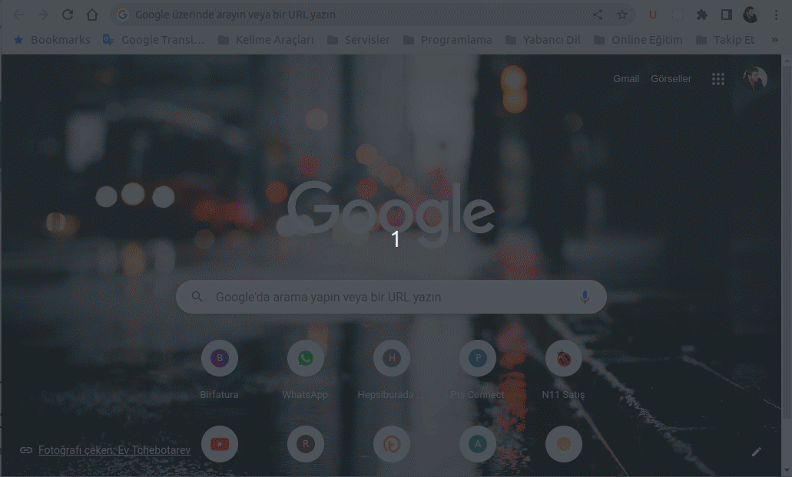

# server-with-nodejs
A simple server was created with Node JS. 

Node Js kullanılarak hazırlandı. Anasayfa, hakkında ve iletişim sayfaları bulunmakta.



```
const server = http.createServer(...);
```

Şeklinde sunucuyu oluşturuyoruz. Sunucuya req ve res olmak üzere 2 parametre geçiyor. Burada gelen urlyi **req.url** üzerinden alıyoruz. Sayfa header bilgisini **res.writeHead** metodu ile giriyoruz. 

Sonrasında url denetlenerek hangi sayfaya gidileceğine karar veriliyor. Gelen urlye göre anasayfa, iletişim ve hakkımızda sayfaları ekrana basılıyor. Eğer girilen urlnin sunucuda bir karşılığı yoksa ise, 404 kodu ile sayfa bulunamadı hatası veriliyor.

Sayfa tasarımı için template string kullanıldı.

```
function createPage(title, content) {
    return `
    <!DOCTYPE html>
    <html lang="en">
    <head>
        <meta charset="UTF-8">
        <meta http-equiv="X-UA-Compatible" content="IE=edge">
        <meta name="viewport" content="width=device-width, initial-scale=1.0">
        <title>${title}</title>
    </head>
    <body style='text-align:center, background-color:'>
        <h1>${title}</h1>
        ${content}

        <p>
        <a href="/">Ana Sayfa</a>
        | <a href="/contact">İletişim</a>
        | <a href="/about">Hakkımızda</a>
        </p>
        <hr />
        <p><a href="https://github.com/selamidemir">Github</a> 
        | <a href="https://netbilio.com">Netbilio</a>
        </p>
    </body>
    </html>
    `;
}
```

Bu şekilde basit bir sayfa tasarımı yaparak, sadece başlık ve içeriği istenilen urlye göre değiştirdik.

Template string kulanılan createPage fonksiyonunu çağırmak için

```
createPage("Başlık içeriği","Sayfa içeriği");
```

şeklinde bir kullanım yeterli olacaktır.


